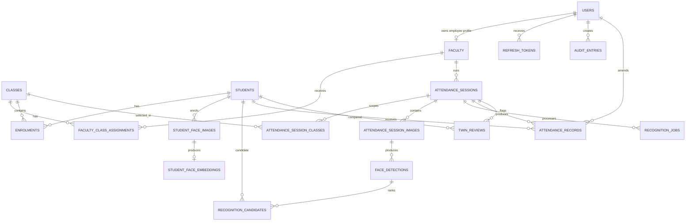

# EduTrace Database Design

## Database purpose

PostgreSQL is the authoritative store for identity, academic structure, biometric metadata, processing evidence, final attendance decisions, settings, and audit history. Image bytes are stored privately on disk in the local beta or in S3-compatible storage in deployment; PostgreSQL stores their object keys, checksums, dimensions, MIME types, and processing metadata. Apply current Alembic migrations before using the API; exact row counts depend on whether local seed data has been run.

Development can store embeddings as JSON by setting `EDUTRACE_PGVECTOR_ENABLED=false`. A pgvector deployment stores each normalized face embedding as `vector(512)`. Application code must never return a raw embedding through an API or write one to logs.

## Relationship diagram



## Identity and access tables

### `users`

Stores accounts that can authenticate.

| Important column | Meaning |
|---|---|
| `id` | UUID primary key |
| `email` | Unique login email |
| `password_hash` | Argon2 password hash; never plaintext |
| `role` | `ADMIN`, `FACULTY`, or `STUDENT` |
| `is_active` | Authentication enabled flag |
| `created_at` | Account creation time |
| `version` | Optimistic concurrency version |

The first release creates user accounts for Admin and Faculty. Student API access is reserved for later use.

### `refresh_tokens`

Stores only hashes of rotating refresh tokens. Each row belongs to a user and has an expiry and optional revocation timestamp. Deleting a user cascades to these rows.

### `faculty`

One-to-one employee profile for a Faculty user. `user_id` and `employee_id` are unique. Department, designation, and `ACTIVE`, `INACTIVE`, or `ON_LEAVE` status control how the employee appears and whether they should be assigned work.

### `students`

Stores institutional student identity and academic placement. `student_id` and `roll_number` are independently unique. The UUID `id` is used for foreign keys; institutional identifiers remain editable business values.

## Academic structure tables

### `classes`

Defines a subject offering using a unique class code, subject, department, semester, section, and academic session. `archived=true` preserves history while removing the class from active workflows.

### `faculty_class_assignments`

Join table between Faculty and Classes. The pair `(faculty_id, class_id)` is unique, preventing duplicate assignments. Deleting a Faculty profile or Class cascades to the assignment.

### `enrolments`

Join table between Students and Classes. The pair `(student_id, class_id)` is unique. It defines the candidate pool for recognition: a session must never match a Student who is outside all selected classes.

Deleting a Student or Class cascades to current enrolment rows. Historical attendance records should be retained by archiving business entities instead of physically deleting them after real attendance exists.

## Face enrolment tables

### `student_face_images`

Stores one row per private enrolment image.

| Column | Meaning |
|---|---|
| `student_id` | Owner of the face image |
| `object_key` | Unique private-storage address |
| `checksum` | Content checksum used for duplicate detection |
| `mime_type`, `width`, `height` | Verified decoded image metadata |
| `quality` | JSON quality measurements and processing status |
| `revoked_at` | Soft-revocation time; `NULL` means active |
| `created_at`, `version` | Traceability and concurrency |

The application accepts 3–5 active images per Student. Revocation is preferred over deletion so old recognition evidence remains explainable.

### `student_face_embeddings`

Contains one embedding for one face image. `image_id` is unique, enforcing the one-image/one-template relationship. `model_version` identifies the exact embedding model. `revoked_at` allows the template to be removed from future matching without erasing historical metadata.

The deployment representation should be `vector(512)` containing an L2-normalized vector. Because matching is restricted to selected classes and at most 500 candidates, exact cosine comparison is the initial design. Add an HNSW index only after a benchmark demonstrates a need.

## Attendance session tables

### `attendance_sessions`

Represents one attendance event owned by Faculty. It records the attendance date, processing status, scope-lock time, finalization time, creation time, and version.

Valid status progression is normally:

```text
DRAFT -> QUEUED -> PROCESSING -> PENDING_REVIEW or READY -> FINALIZED
                         \-> FAILED -> retry -> QUEUED
```

Once `scope_locked_at` is set, the selected classes must not change.

### `attendance_session_classes`

Join table containing all classes selected for a session. `(session_id, class_id)` is unique. At least one class is required before processing. The union of enrolments in these classes forms the only permitted recognition pool.

### `attendance_session_images`

Stores metadata for each of the 1–8 classroom images. `(session_id, checksum)` is unique, preventing the same image from being uploaded twice to one session. `processing_error` allows one bad image to fail independently while the worker continues with the remaining images.

### `recognition_jobs`

Tracks asynchronous processing state. `idempotency_key` is globally unique and is derived from session ID, image checksums, and model version. `status`, `stage`, `progress`, `attempts`, timestamps, and a safe `error_code` support polling and retry recovery.

## Recognition evidence tables

### `face_detections`

Stores each detected face, including its source classroom image, image-relative bounding box JSON, quality JSON, and detector model version. It does not assume that every detection belongs to a known Student.

### `recognition_candidates`

Stores ranked Student candidates for a detection. `(detection_id, student_id)` is unique. `score` is a model similarity score, not a probability, and `rank` preserves the top-candidate ordering used for review and explainability.

Candidate rows must contain only Students drawn from the selected-class enrolment pool.

### `attendance_records`

Stores exactly one row per eligible Student per session. The database constraint on `(session_id, student_id)` prevents duplicates across multiple classroom images or job retries.

| Column | Meaning |
|---|---|
| `ai_status` | Immutable automated decision |
| `status` | Current faculty-controlled decision |
| `score` | Best aggregated model similarity, when available |
| `review_reason` | Why recognition needs review |
| `model_version` | Recognition model that created the evidence |
| `amended_by`, `amended_at`, `amendment_reason` | Latest faculty amendment metadata |
| `version` | Optimistic concurrency version |

Supported attendance values are `PRESENT`, `ABSENT`, `REVIEW`, and `UNKNOWN`. Faculty changes update `status`; they must never rewrite `ai_status`, score, or model version.

### `twin_reviews`

Represents a close or twin-like identity pair inside one session. The session and ordered student pair are unique. Resolution stores who resolved it and when. Application code should normalize the student order before insertion so reversing a pair cannot bypass uniqueness.

## Governance tables

### `audit_entries`

Append-only record of significant mutations. Each row contains actor, action, entity type and ID, before/after JSON, reason, and creation time. The API intentionally exposes reading and does not expose update or delete operations.

Examples include faculty creation, class assignment, enrolment changes, face-image revocation, processing retry, attendance finalization, and post-finalization amendment.

### `institution_settings`

A singleton row, normally `id=1`, containing institution name, attendance warning threshold, image-retention period, update time, and version. These are backend-owned policies consumed by the frontend.

## Required uniqueness and integrity rules

| Rule | Database enforcement |
|---|---|
| One account per email | Unique `users.email` |
| One employee profile per user and employee number | Unique `faculty.user_id` and `faculty.employee_id` |
| Unique student identifiers | Unique `students.student_id` and `students.roll_number` |
| Unique class code | Unique `classes.code` |
| No repeated assignment | Unique faculty/class pair |
| No repeated enrolment | Unique student/class pair |
| One template per enrolment image | Unique embedding `image_id` |
| No duplicate classroom upload in a session | Unique session/checksum pair |
| Idempotent recognition processing | Unique job `idempotency_key` |
| No repeated candidate per face | Unique detection/student pair |
| One attendance row per student per session | Unique session/student pair |
| No repeated twin case | Unique session/student-A/student-B tuple |

Additional application-level rules include 3–5 active face images, 1–8 session images, at least one selected class, a maximum 500-person candidate pool, class scope authorization, immutable processing scope, and amendment reasons after finalization.

## Expected database state through a normal workflow

| Workflow stage | Expected rows |
|---|---|
| Fresh reset | One Admin `users` row and one `institution_settings` row |
| Faculty created | New Faculty `users` row plus matching `faculty` row |
| Student and class configured | `students`, `classes`, assignment, and enrolment rows |
| Face gallery completed | 3–5 active image rows and matching embedding rows per Student |
| Attendance capture uploaded | One session, selected-class rows, and 1–8 session-image rows |
| Recognition completed | One job, detections, ranked candidates, and one attendance record per eligible Student |
| Faculty finalizes | Session becomes `FINALIZED`; corrections and audits remain traceable |

After a fresh migration with the administrator seed only, the database contains one Admin and one settings row. The demo seed adds sample faculty, students, classes, enrolments, and related records; do not assume a clean database when interpreting counts.

## Storage relationship

Database transactions cannot automatically roll back an S3 or filesystem operation. Upload handling should therefore:

1. Validate and decode the image.
2. Calculate the checksum.
3. Write the private object.
4. Insert its metadata row.
5. Delete the object if the database insert fails.

Database rows contain object keys rather than public URLs. The API creates short-lived, scoped signed URLs when authorized users request image content.

## Migrations and schema management

SQLAlchemy models live in `backend/app/models.py`. Alembic migrations live in `backend/alembic/versions` and are the deployment mechanism.

Use:

```powershell
cd backend
alembic upgrade head
```

`Base.metadata.create_all` is permitted in development and tests for convenience. Production should apply reviewed Alembic migrations and must not depend on automatic table creation.

Before a destructive migration:

1. Back up PostgreSQL and private image storage together.
2. Test the migration on a restored copy.
3. Verify row counts, foreign keys, and uniqueness constraints.
4. Deploy the API and worker versions compatible with the new schema.
5. Keep a rollback migration or restore procedure.

## Index and performance guidance

The schema indexes identifiers and common scope columns such as user email, employee ID, student ID, roll number, names, departments, class code, session status, foreign keys, model version, and audit time. Pagination and filtering should happen in SQL before rows are returned.

Recognition initially loads only active embeddings for Students enrolled in selected classes. Exact vector comparison is appropriate for the configured maximum of 500 candidates. Benchmark query time and recognition accuracy before introducing approximate vector indexing because approximate search trades recall for speed.

## Privacy and operational rules

- Encrypt PostgreSQL volumes and image storage in deployment.
- Use TLS between clients, API, database, Redis, and object storage.
- Never expose `password_hash`, refresh-token hashes, or embeddings.
- Do not place face crops, biometric vectors, tokens, or signed URLs in logs.
- Apply the configured retention period to private session images.
- Revoke face templates without erasing historical attendance evidence.
- Restrict direct database access; routine changes must pass through API authorization and auditing.
- Back up the database and object store as one logical dataset so metadata never points to missing evidence after restoration.

