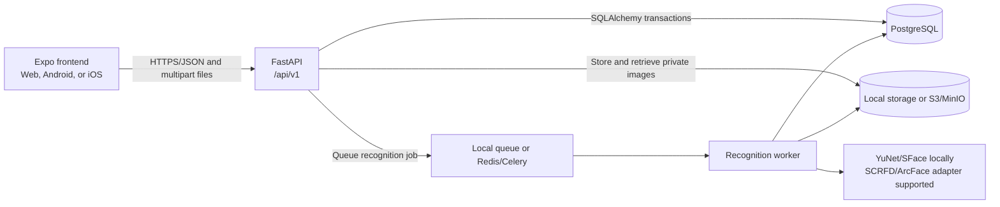
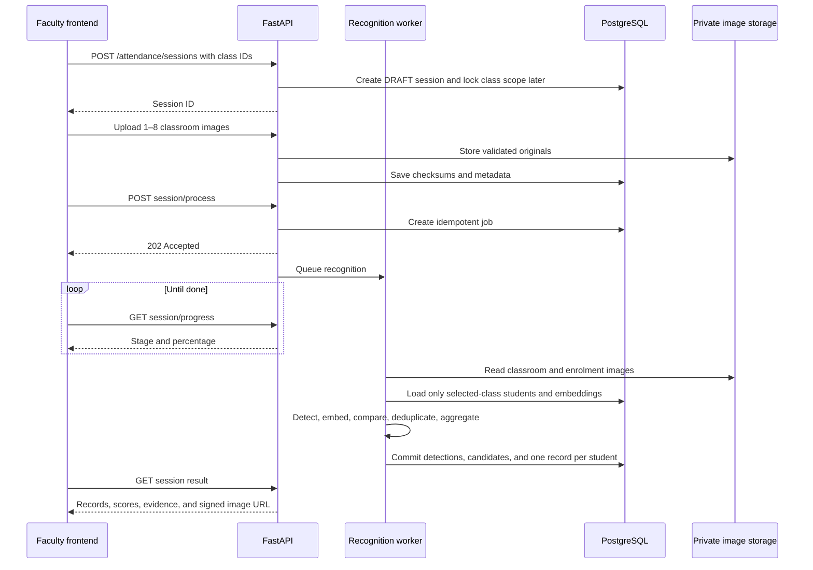

# Frontend and Backend Integration Guide

## Purpose

EduTrace is an Expo/React Native frontend connected to a FastAPI backend. The frontend contains no mock dataset or mock service switch. Faculty, students, classes, face images, attendance sessions, reports, settings, and audit entries shown in the application are fetched from the backend.

The backend is the source of truth. PostgreSQL stores structured application data, private object storage holds images, and the recognition worker processes face images outside the API request that accepted them.



## Current local addresses

| Component | Address | Purpose |
|---|---|---|
| Expo web frontend | `http://127.0.0.1:8081` | Application used by Admin and Faculty |
| API base URL | `http://127.0.0.1:8010/api/v1` | Base used by the frontend API client |
| Swagger UI | `http://127.0.0.1:8010/docs` | Interactive backend documentation |
| Liveness | `http://127.0.0.1:8010/api/v1/health/live` | Confirms the API process is running |
| Readiness | `http://127.0.0.1:8010/api/v1/health/ready` | Confirms the API and database are available |

The frontend base URL is configured in `.env`:

```env
EXPO_PUBLIC_API_BASE_URL=http://127.0.0.1:8010/api/v1
```

`EXPO_PUBLIC_` values are bundled into the client and must never contain passwords or secrets. Backend secrets belong in `backend/.env` or deployment secret management.

## How requests travel through the application

1. A screen uses a hook in `src/hooks`.
2. The hook calls an interface exported by `src/services`.
3. `src/services/index.ts` always selects the real API implementations in `src/api`.
4. `src/api/client.ts` adds the API base URL, access token, JSON headers, query parameters, and error handling.
5. FastAPI authenticates the request and checks role and data scope inside backend services and queries.
6. SQLAlchemy reads or changes PostgreSQL in a transaction.
7. The API returns JSON and TanStack Query updates or invalidates the relevant frontend cache.

There is no mock fallback. If the backend is unavailable, the frontend displays an error and retry action instead of invented data.

## Authentication connection

### Login

The frontend sends the entered email or employee identifier and password to:

```http
POST /api/v1/auth/login
Content-Type: application/json

{
  "identifier": "admin@example.edu",
  "password": "LocalTest123!"
}
```

The backend verifies the Argon2 password hash and returns an access token, rotating refresh token, and current user. The frontend stores the session using secure storage where supported.

### Authenticated requests

The frontend sends:

```http
Authorization: Bearer <access-token>
```

Access tokens are short lived. When a request receives `401`, the client attempts one refresh through `POST /auth/refresh`, stores the rotated session, and retries the original request once. A failed refresh clears the local session and returns the user to login. Logout calls `POST /auth/logout` and removes the local credentials.

## Frontend feature to API mapping

| Frontend feature | Backend endpoints |
|---|---|
| Login and current account | `/auth/login`, `/auth/refresh`, `/auth/logout`, `/auth/me` |
| Faculty employee management | `/faculty`, `/faculty/{id}`, `/faculty/{id}/status` |
| Student management | `/students`, `/students/{id}` |
| Class management | `/classes`, `/classes/{id}` |
| Faculty assignment | `/classes/{id}/faculty` |
| Student enrolment in classes | `/classes/{id}/enrolments` |
| Student face gallery | `/students/{id}/face-images` and its revoke/reprocess routes |
| Attendance history | `/attendance/sessions` |
| Classroom capture | `/attendance/sessions`, then session image upload and processing routes |
| Processing screen | `/attendance/sessions/{id}/progress` |
| Results and evidence | `/attendance/sessions/{id}` and annotated image endpoint |
| Manual correction | `/attendance/records/{id}` |
| Twin review | Session twin-review list and resolution endpoints |
| Finalization and retry | Session `/finalize` and `/retry` endpoints |
| Reports | `/reports/attendance`, `/reports/attendance/students` |
| Downloads | `/attendance/sessions/{id}/export?format=csv|xlsx|pdf|json` |
| Institution settings | `/settings/institution` |
| Audit history | `/audit` |

## Correct setup order from an empty database

The Admin should create data in this order because later records reference earlier ones:

1. Log in with the seeded administrator account.
2. Add Faculty employees. The current beta frontend creates each account with temporary password `ChangeMe123!`.
3. Add Students with unique student ID and roll number.
4. Create Classes.
5. Assign one Faculty employee to each class.
6. Enrol Students in the appropriate classes.
7. Open every Student profile and upload 3–5 clear, recent face images.
8. Have the Faculty employee log in, select a class, and take attendance.

The temporary faculty password is suitable only for local beta testing. Production must collect or generate a one-time password and force the employee to change it.

## Face enrolment workflow

The frontend image picker accepts 3–5 images and uploads them as `multipart/form-data` to the student's face-image endpoint. The API validates file content and image limits before storage. The recognition adapter requires exactly one usable face per enrolment image, creates a normalized 512-dimensional embedding, and stores quality and model-version metadata.

The frontend can list the gallery, revoke an image, or ask the backend to reprocess active images. Revocation is soft so historical recognition evidence remains traceable.

Recommended enrolment images should be recent and should vary slightly in angle, lighting, expression, glasses, or facial hair. Old photographs alone may produce lower similarity against a current classroom face.

## Multi-image attendance workflow



The camera screen can collect up to eight views. The frontend uploads every collected image before starting processing. The worker searches only students enrolled in the selected classes and deduplicates a student recognized in several photographs.

Attendance interpretation in the current beta is:

- A strong, sufficiently separated enrolled match becomes `PRESENT`.
- A low-quality, weak, or ambiguous enrolled match becomes `REVIEW`.
- If processing succeeds and an enrolled student has no reliable face match, that student becomes `ABSENT`.
- If processing cannot make a reliable decision because required evidence is unavailable, the enrolled student can remain `UNKNOWN`.
- A detected person who has no matching enrolled identity is labelled `Unknown` on the annotated image. That person is not inserted into the student review table because no database student record exists to review.

The score is model similarity, not a probability. The configured local match threshold is `0.50`; it must be calibrated with representative institutional images before production.

## Results, images, and downloads

The result response combines the session, selected classes, student identity fields, attendance records, supporting detections, review items, image metadata, and summary counts. Automated `ai_status` remains separate from the faculty-controlled final `status`.

Annotated classroom images use short-lived signed URLs so the React Native image component can load them without exposing an access token in a permanent URL. Raw embeddings are never returned by the API.

On web, the export buttons request authenticated CSV, XLSX, PDF, or JSON content and start a browser download. The export always comes from backend records rather than frontend cache.

## Errors and concurrency

Backend errors use problem-detail responses. The API client converts these to typed frontend errors for loading, empty, permission, validation, conflict, expired-session, and server-failure states.

Mutable database records carry a `version` number. Update forms first read the current version and submit it with the change. A stale edit receives a conflict instead of silently overwriting a newer change.

Processing uses an idempotency key based on the session, uploaded image checksums, and model version. Retrying a job must not create duplicate detections or attendance records.

## Local testing checklist

1. Confirm `/api/v1/health/live` returns `{"status":"ok"}`.
2. Confirm `/api/v1/health/ready` reports the database as ready.
3. Open the frontend and log in as Admin.
4. Create two faculty accounts, several students, and at least one class.
5. Assign Faculty and enrol Students.
6. Upload 3–5 photographs for each Student.
7. Log out and log in as the assigned Faculty employee.
8. Capture several overlapping classroom views.
9. Wait for processing and inspect the annotated image, scores, and student records.
10. Resolve review items, finalize the session, and verify each export format.
11. Log back in as Admin and confirm history, reports, and audit entries reflect the same backend data.

## Common connection problems

| Symptom | Check |
|---|---|
| Frontend shows a network error | API is running and `EXPO_PUBLIC_API_BASE_URL` points to the correct host and port |
| Browser reports a CORS error | The frontend origin is included in `EDUTRACE_CORS_ORIGINS` |
| `401 Invalid access token` | Reload or log in again; a database reset invalidates every old token |
| Faculty sees no class | The Admin must assign that Faculty employee to the class |
| Class has no candidates | Students must be enrolled and have active face embeddings |
| Every person is Unknown | Check face enrolment quality, model status, threshold, and whether the correct class was selected |
| Image does not display | Verify the signed URL has not expired and the stored object still exists |
| Processing does not progress | Check the local worker or Celery worker and Redis configuration |

## Deployment differences

Local beta mode uses PostgreSQL with local private storage, a local worker, and OpenCV YuNet/SFace models. The deployment compose file provides PostgreSQL 17 with pgvector, Redis, MinIO, FastAPI, and a Celery GPU worker. Deployment must use HTTPS, strong secrets, licensed model weights, private encrypted storage, database backups, and a calibrated recognition threshold.

